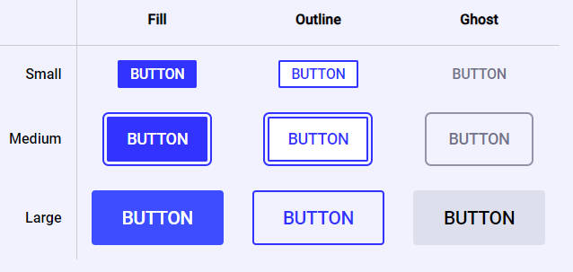

## Button Component Exercise

This is a CSS-in-JS exercise from the course [_CSS for JavaScript Developers_](https://courses.joshwcomeau.com/css-for-js) created by Josh Comeau.

The task was to build a dynamic button component with multiple variants, states and sizes using the following technologies:

- [React](https://react.dev),
- [styled-components](https://styled-components.com),
- CSS variables.

The design file and starter code were available on _Figma_ and _CodeSandbox_.

I started the project with `create-react-app`, and used the _Babel_ plugin recommended by Josh to obtain semantically-meaningful component class names: [`babel-plugin-styled-components`](https://www.npmjs.com/package/babel-plugin-styled-components).

<figure>
    
</figure>
